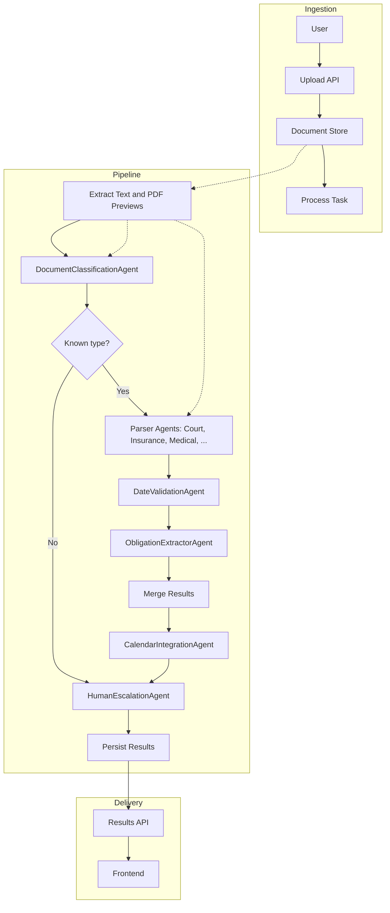
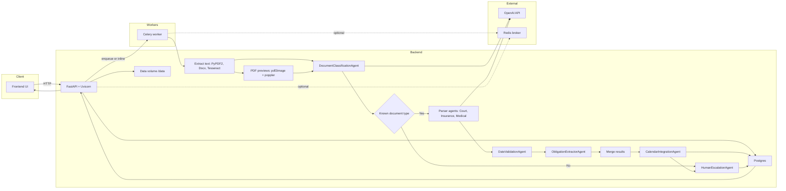

# Legal Document Processor

A multi-agent legal document processing system for personal injury law firms. It extracts critical dates and obligations from diverse documents, validates them, and integrates with a case calendar. Backend is FastAPI + Celery + PostgreSQL + Redis. Frontend is React + TypeScript.

## Features
- Multi-agent architecture with classification, specialized parsers, date validation, obligation extraction, calendar integration, and human escalation.
- Document formats: PDF, DOCX, images (OCR via Tesseract), plaintext.
- Async processing with Celery workers and Redis broker.
- PostgreSQL persistence for documents and calendar events.
- React frontend with file upload, processing status, calendar view, and human review.

## Concept Data Flow


## Architecture Overview
- Backend: `backend/app/`
  - Agents in `app/agents/`
  - API in `app/api/`
  - Models and DB in `app/models/`
  - Services and Celery in `app/services/`
- Frontend: `frontend/`
- Infrastructure: Docker Compose with backend, worker, frontend, postgres, redis, minio.

## Systems Diagram


### Agents
- Document Classification Agent (`app/agents/document_classifier.py`)
- Specialized Parsers (`app/agents/parsers/`): court, insurance, medical, settlement, discovery, employment
- Date Validation Agent (`app/agents/date_validator.py`)
- Obligation Extraction Agent (`app/agents/obligation_extractor.py`)
- Calendar Integration Agent (`app/agents/calendar_integrator.py`)
- Human Escalation Agent (`app/agents/human_escalation.py`)

## Quick Start

1. Copy env template and adjust as needed:
```bash
cp .env.example .env
```

2. Start services:
```bash
docker compose up --build
```

3. Backend API: http://localhost:8000/docs

4. Frontend: http://localhost:5173

## API Endpoints (v1)
- `POST /api/v1/documents/upload` (multipart form `file`, optional `case_id`)
- `GET /api/v1/documents/{document_id}/status`
- `GET /api/v1/documents/{document_id}/result`
- `GET /api/v1/cases/{case_id}/calendar`
- `POST /api/v1/cases/{case_id}/calendar/events`

## Development
- Backend hot-reloads mounted via Docker volume.
- Celery worker runs in a separate container.
- Ensure Tesseract is available (provided in backend image).

## Testing
- Run backend tests in container:
```bash
docker compose exec backend pytest -q
```

## Data Models (Pydantic)
See `app/models/schemas.py` for `ExtractedDate`, `LegalObligation`, `DocumentClassification`, `ProcessingResult`.

## Roadmap
- Improve NLP with spaCy/transformers pipelines.
- Jurisdiction-aware rules engine for deadlines.
- S3-backed document storage and retrieval.
- Role-based auth and audit trails.

## Notes
- This is a scaffolding with heuristics and placeholders intended to be extended.
- Pydantic AI agent framework is included as a dependency; current agents are structured to be upgraded to fully utilize it.
