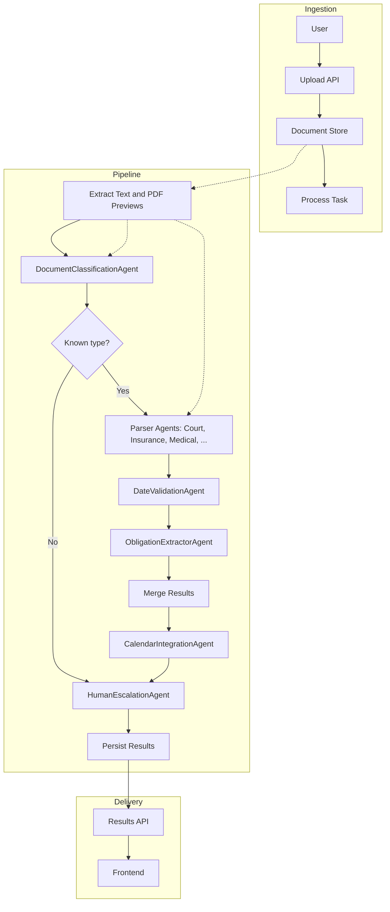
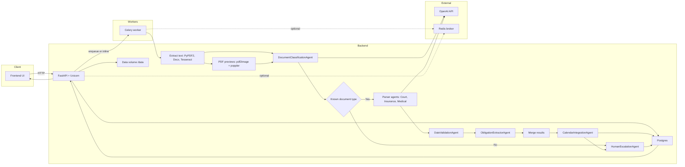

# Legal Document Processor

A multi-agent legal document processing system for personal injury law firms. It extracts critical dates and obligations from diverse documents, validates them, and integrates with a case calendar. Backend is FastAPI + Celery + PostgreSQL + Redis. Frontend is React + TypeScript.

## Features
- Multi-agent architecture with classification, specialized parsers, date validation, obligation extraction, calendar integration, and human escalation.
- Document formats: PDF, DOCX, images (OCR via Tesseract), plaintext.
- Async processing with Celery workers and Redis broker.
- PostgreSQL persistence for documents and calendar events.
- React frontend with file upload, processing status, calendar view, and human review.

## Concept Data Flow


## Architecture Overview
- Backend: `backend/app/`
  - Agents in `app/agents/`
  - API in `app/api/`
  - Models and DB in `app/models/`
  - Services and Celery in `app/services/`
- Frontend: `frontend/`
- Infrastructure: Docker Compose with backend, worker, frontend, postgres, redis, minio.

## Systems Diagram


### Agents
- Document Classification Agent (`app/agents/document_classifier.py`)
- Specialized Parsers (`app/agents/parsers/`): court, insurance, medical, settlement, discovery, employment
- Date Validation Agent (`app/agents/date_validator.py`)
- Obligation Extraction Agent (`app/agents/obligation_extractor.py`)
- Calendar Integration Agent (`app/agents/calendar_integrator.py`)
- Human Escalation Agent (`app/agents/human_escalation.py`)

## AI Document Classifier and Court Order Parser

### Document Classification (`app/agents/document_classifier.py`)
- **Model selection**: Reads `OPENAI_MODEL` from environment (Fly secret or `.env`). If unset, defaults to `gpt-4o-mini`. The deployed configuration currently sets `OPENAI_MODEL=gpt-5-nano`.
- **Multimodal input**: Uses extracted text (truncated to ~12k chars) and up to 2 preview page images (embedded as `image_url`).
- **Prompt (system)**:
  ```text
  You are a legal document classification agent for a personal injury law firm. Classify the document into one of the allowed types and extract metadata. Allowed types strictly limited to: court_order, insurance_correspondence, medical_records, settlement_communication, discovery_request, employment_records, expert_witness_report, police_report, unknown. Respond ONLY with a compact JSON object with keys: document_type (one of allowed), confidence_score (0..1), sub_type (string or null), jurisdiction (string or null), parties_involved (array of strings).
  ```
- **Prompt (user content)** includes:
  - Instruction to determine type and extract metadata.
  - Extracted text body.
  - Inline `image_url` parts for page previews when available.
- **Output handling**: Parses JSON and sanitizes fields. If the LLM call or JSON parsing fails, returns `unknown` to trigger escalation.

### Court Order Parser (`app/agents/parsers/court_parser.py`)
- **Model selection**: Also controlled by `OPENAI_MODEL` (same value as classifier). Deployed model: `gpt-5-nano`.
- **LLM-first extraction**: Specialized for court and scheduling orders; uses text plus up to 2 preview images.
- **Prompt (system)**:
  ```text
  You are a legal parsing agent specialized in COURT ORDERS and SCHEDULING ORDERS. Using the extracted text and any provided page images, extract key dates and obligations.

  Return ONLY JSON with fields:
  - dates: array of {date_iso (ISO8601), date_type (hearing|conference|trial|deadline), source_text}
  - obligations: array of {description, due_date_iso (ISO8601), responsible_party, priority_level}

  Rules:
  - Only include an obligation if a due_date is explicitly present; otherwise omit it.
  - Do not hallucinate. If not sure, leave arrays empty.
  ```
- **Prompt (user content)**: Requests hearing/trial/conference dates, filing deadlines, and obligations with due dates, followed by the extracted text.
- **Parsing**: Dates and obligations are normalized and converted into `ExtractedDate` and `LegalObligation` objects. If no usable content is returned, the parser escalates by returning empty arrays.

### Base Parser JSON mode (`app/agents/parsers/base_parser.py`)
- **Strict JSON response**: Uses `response_format={"type": "json_object"}` to request structured JSON and applies the following generic system prompt:
  ```text
  You are a legal document parsing agent. Using the extracted text and any provided page images, extract key dates and obligations from any legal document.

  Return ONLY JSON with fields:
  - dates: array of {date_iso (ISO8601), date_type (string), source_text}
  - obligations: array of {description, due_date_iso (ISO8601), responsible_party, priority_level}

  Rules:
  - Only include an obligation if a due_date is explicitly present; otherwise omit it.
  - Keep types concise (e.g., hearing, trial, deposition, deadline, mediation, appointment).
  - Do not hallucinate. If not sure, leave arrays empty.
  ```
- **Fallback behavior**: Any call or JSON parse failure results in an empty output to trigger human escalation.

### Deployed LLM model
- The production deployment reads `OPENAI_MODEL` from Fly secrets. Current setting: `gpt-5-nano`.
- To change the model:
  ```bash
  # from backend/
  fly secrets set OPENAI_MODEL=gpt-4o-mini -a <your-backend-app>
  ```
- If not set, the code defaults to `gpt-4o-mini`.

## Quick Start

1. Copy env template and adjust as needed:
```bash
cp .env.example .env
```

2. Start services:
```bash
docker compose up --build
```

3. Backend API: http://localhost:8000/docs

4. Frontend: http://localhost:5173

## API Endpoints (v1)
- `POST /api/v1/documents/upload` (multipart form `file`, optional `case_id`)
- `GET /api/v1/documents/{document_id}/status`
- `GET /api/v1/documents/{document_id}/result`
- `GET /api/v1/cases/{case_id}/calendar`
- `POST /api/v1/cases/{case_id}/calendar/events`

## Development
- Backend hot-reloads mounted via Docker volume.
- Celery worker runs in a separate container.
- Ensure Tesseract is available (provided in backend image).

## Testing
- Run backend tests in container:
```bash
docker compose exec backend pytest -q
```

## Data Models (Pydantic)
See `app/models/schemas.py` for `ExtractedDate`, `LegalObligation`, `DocumentClassification`, `ProcessingResult`.

## Roadmap
- Improve NLP with spaCy/transformers pipelines.
- Jurisdiction-aware rules engine for deadlines.
- S3-backed document storage and retrieval.
- Role-based auth and audit trails.

## Notes
- This is a scaffolding with heuristics and placeholders intended to be extended.
- Pydantic AI agent framework is included as a dependency; current agents are structured to be upgraded to fully utilize it.
